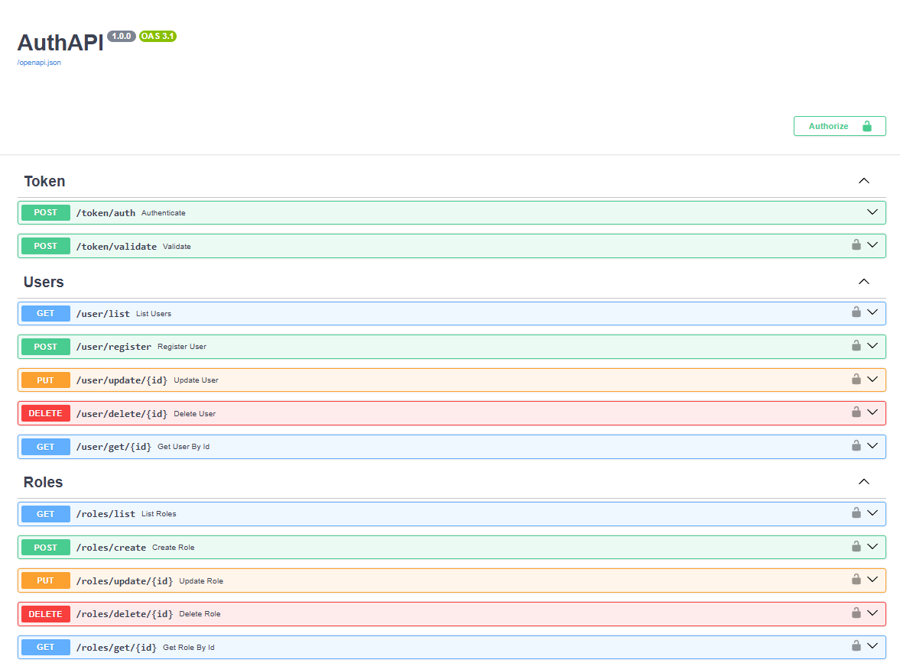
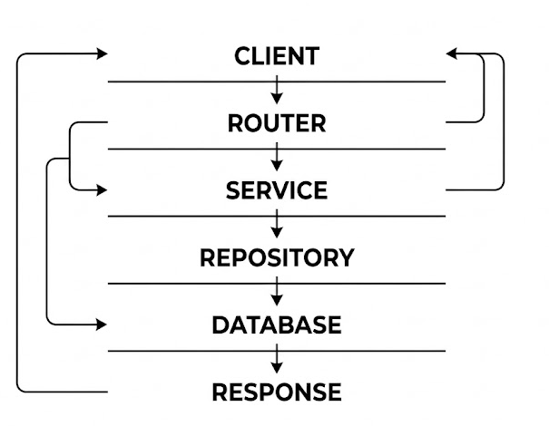

# Auth Microservice

## TL;DR

Production-inspired authentication microservice featuring JWT authentication,
RBAC authorization and layered architecture, designed to simulate a centralized authentication service used in real-world systems.
Designed as a standalone authentication service capable of integrating into a microservices ecosystem.


## API Documentation Preview

  

## What This Project Demonstrates

This project showcases:

- Authentication system design
- Secure API architecture
- Layered backend organization
- RBAC authorization strategies
- Stateless service design
- Backend engineering best practices

## Architecture Style:  
Layered Architecture with Service Layer and Repository Pattern,
inspired by Clean Architecture principles.

---

## Quick Start

### 1. Clone

```bash
git clone https://github.com/seu-usuario/auth-microservice.git
cd auth-microservice
```

### 2. Virtual Environment

```bash
python -m venv venv
```

Windows:

```bash
venv\\Scripts\\activate
```

Linux/macOS:

```bash
source venv/bin/activate
```

### 3. Install dependencies

```bash
pip install -r requirements.txt
```

---

## Environment Variables

`.env` file:

```env
DATABASE_URL=
SECRET_KEY=super_secret_key

TYPE=
PROJECT_ID=
PRIVATE_KEY_ID=
PRIVATE_KEY=
CLIENT_EMAIL=
CLIENT_ID=
AUTH_URI=
TOKEN_URI=
AUTH_PROVIDER_X509_CERT_URL=
CLIENT_X509_CERT_URL=
UNIVERSE_DOMAIN=
```

---

## Running

```bash
uvicorn app:app --reload
```

Auto Docs:

* Swagger → [http://localhost:8000/docs](http://localhost:8000/docs)
* ReDoc → [http://localhost:8000/redoc](http://localhost:8000/redoc)

---

## Example Request

### Authenticate User

POST /token/auth

Request:

{
  "email": "teste@email.com",
  "password": "teste123"
}

Response:

{
  "access_token": "jwt_token",
  "token_type": "Bearer",
  "expire_at": "2026-03-04T02:51:11.358Z"
}

---

# Português

## Visão Geral

Auth Microservice é uma API REST de autenticação e autorização construída com FastAPI, utilizando Firebase Realtime Database como persistência e JWT para autenticação baseada em tokens.

O projeto foi desenvolvido seguindo padrões modernos de backend utilizados em ambientes profissionais, com foco em:

* Arquitetura em camadas
* Separação clara de responsabilidades
* Segurança aplicada
* RBAC (Role‑Based Access Control)
* Código modular e escalável

Serviço desenvolvido para ser consumido por aplicações diversas, como fornecedor centralizado de autenticação.

---

## Por quê?

Projeto criado para modelar um microsserviço de autenticação próximo a cenários reais de produção:

- fluxos de autenticação
- estrutura escalável
- arquitetura de produção
- demonstração prática de engenharia backend

---

## Objetivos

- Demonstrar estrutura back-end a nível de produção
- Aplicar práticas de segurança de autenticação
- Projetar estrutura em camadas
- Simular um microsserviço de autenticação
- Para aprendizado e referência de portfolio

---

## Arquitetura

A aplicação segue princípios próximos de Clean Architecture / Service Layer Pattern.



### Camadas

| Camada       | Responsabilidade                      |
| ------------ | ------------------------------------- |
|   Routers    | Endpoints HTTP e validação de entrada |
|   Services   | Regras de negócio                     |
|   Repository | Abstração do acesso ao banco de dados |
|   Models     | Schemas Pydantic e entidades          |
|   Config     | Segurança e variáveis de ambiente     |
|   Database   | Integração com Firebase               |

---

## Stacks Usadas

* Python 3.11+
* FastAPI
* Firebase Realtime Database
* JWT (python‑jose)
* Passlib + Argon2
* Pydantic
* Email Validator
* Python‑dotenv

---

## Segurança Implementada

- Hash de senha com Argon2  
- Autenticação via JWT Bearer Token  
- Expiração automática de token  
- Middleware de validação centralizado  
- RBAC (controle por roles)  
- Validação de email e dados  
- Proteção de rotas administrativas  

---

## Decisões

- Camada de serviço (service) para separar as regras de negócio da camada HTTP (routes)
- Uso do JWT ao invés de sessões para escalabilidade stateless
- Hash com Argon2 para guardar senhas de forma segura

## Trade-Offs

- Firebase para desenvolvimento ágil ao invés de banco relacional
- Sem refresh tokens para manter a autenticação simples
- Deploy monolítico para reduzir a complexidade operacional

---

## Autenticação

### Fluxo

1. Usuário envia `email` e `password`
2. Senha validada via Argon2
3. JWT é gerado contendo o `sub` (ID do usuário)
4. Token enviado no header:

```
Authorization: Bearer <token>
```

Token expira em 60 minutos.

---

## Autorização (RBAC)

A API utiliza Role‑Based Access Control.

Exemplo:

* `ADM` - acesso administrativo
* `USER` - acesso padrão

Proteção aplicada via dependency injection do FastAPI:

```python
Depends(token_service.is_adm)
```

---

## Estrutura do Projeto

```bash
root/
├── config/
│   ├── crypt.py
│   ├── dependencies.py
│   └── env_variables.py
│
├── database/
│   └── firebase.py
│
├── model/
│   ├── schemas/
│       ├── roles.py
│       ├── token.py
│       └── user.py
│   └── dto/
│       ├── user_dto.py
│       └── role_dto.py
|
├── repository/
│   ├── role_repository.py
│   └── user_repository.py
│
├── routers/
│   ├── roles_routes.py
│   ├── token_routes.py
│   └── user_routes.py
│
├── services/
│   ├── roles_service.py
│   ├── token_service.py
│   └── user_service.py
│
├── app.py
├── requirements.txt
└── .env
```

---

## Endpoints Principais

### Token

* `POST /token/auth`
* `POST /token/validate`

### Users (Admin)

* `GET /user/list`
* `POST /user/register`
* `PUT /user/update/{id}`
* `DELETE /user/delete/{id}`
* `GET /user/get/{id}`

### Roles (Admin)

* `GET /roles/list`
* `POST /roles/create`
* `PUT /roles/update/{id}`
* `DELETE /roles/delete/{id}`
* `GET /roles/get/{id}`

---


## Escalabilidade

A arquitetura permite evoluções futuras como:

- Substituir o Database sem alterar camadas acima
- Scalabilidade horizontal (JWT stateless)
- Deploy independente como microsserviço
- Simples integração com outros serviços

---

## Melhorias Futuras

* Refresh Tokens
* Docker
* Testes automatizados (Pytest)
* Observabilidade / Logs estruturados
* Rate Limiting
* Cache Layer

---

# English

## Overview

Auth Microservice is a production‑inspired Authentication & Authorization service built with FastAPI, using Firebase Realtime Database as persistence and JWT for secure token‑based authentication.

This project demonstrates backend engineering practices commonly used in real‑world systems:

* Layered architecture
* Clean separation of concerns
* Secure authentication flows
* RBAC authorization
* Modular and scalable design

This service is designed to be consumed by multiple applications
(e.g., web, mobile, or internal services) as a centralized authentication provider.

---

## Project Goals

- Demonstrate production-grade backend structure
- Apply secure authentication practices
- Showcase layered architecture design
- Simulate a standalone authentication microservice
- Serve as a learning and portfolio reference

---

## Why This Project?

This project was created to simulate a real-world authentication
service used as a standalone microservice, focusing on:

- secure authentication flows
- scalable service separation
- production-ready structure
- backend portfolio demonstration

---

## Architecture

### Layers

| Layer      | Responsibility                 |
| --------   | ------------------------------ |
| Routers    | HTTP endpoints                 |
| Services   | Business logic                 |
| Repository | Data access abstraction layer  |
| Models     | Schemas & entities             |
| Config     | Security & environment         |
| Database   | Firebase integration           |

---

## Security

* Argon2 password hashing
* JWT authentication
* Token expiration
* Centralized token validation
* Role‑Based Access Control (RBAC)
* Email validation
* Protected admin routes

---

## Design Decisions

- Service layer used to isolate business rules from HTTP layer
- JWT used instead of sessions for stateless scalability
- Argon2 selected for stronger password hashing security

## Trade-offs

- Firebase chosen for rapid development instead of relational DB
- No refresh tokens to keep authentication flow simple
- Monolithic deployment to reduce operational complexity

---

## Authentication Flow

1. User sends email & password
2. Password verified using Argon2
3. JWT generated with user ID (`sub` claim)
4. Token sent via:

```
Authorization: Bearer <token>
```

Token lifetime: 60 minutes.

---

## Architecture Decisions (ADR Summary)

| Decision | Reason |
|---------|--------|
| Layered architecture | Improves maintainability |
| Repository pattern | Decouples persistence |
| JWT authentication | Enables stateless scaling |
| Firebase database | Reduces infrastructure overhead |
| Argon2 hashing | Modern password security |

---

## Scalability Considerations

The architecture allows future evolution such as:

- Database replacement without service changes
- Horizontal API scaling (stateless JWT auth)
- Independent deployment as an auth microservice
- Easy integration with other services

---

## Future Improvements

* Refresh tokens
* Docker support
* Automated testing
* CI/CD pipeline
* Monitoring & logging

---

## Author

Backend authentication microservice developed to demonstrate
production-inspired backend architecture and security practices.

---

## License

MIT License — feel free to use, study and improve.

